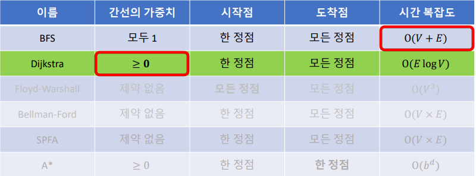
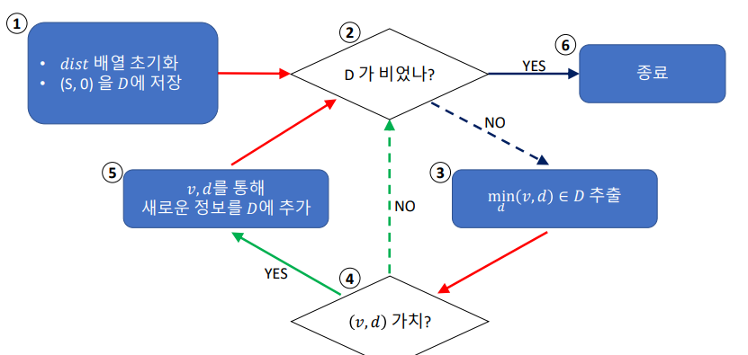

<h1>최단 거리(Shortest Path)</h1>

최단거리 := 그래프의 시작점에서 다른 지점까지의 최단거리   
ex) 네비게이션

<h3> 최단 거리(Shortest Path) 알고리즘 </h3>

<h3> BFS Remind </h3>

탐색(Search) = 시작점에서 간선을 0개 이상 사용해서 갈 수 있는 정점들은 무엇인가?              
Depth First Search / Breadth First Search   

BFS -> 다른 정점까지 "최소 이동 횟수"도 계산 가능   
   한 번의 이동 == 간선의 가중치가 1

<h3>Dijkstra Algorithm 요약</h3>

[Input]
- Graph G(V, E) := Nonnegative - Weighted Graog
- Start Vertex S / Vertices{S_1, ...}

[Output]
- 시작점에서 모든 점까지의 최단거리

[Time Complexity]
- O(E log V)

<h3> Dijkstra Algorithm </h3>

