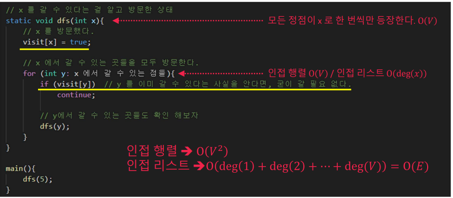
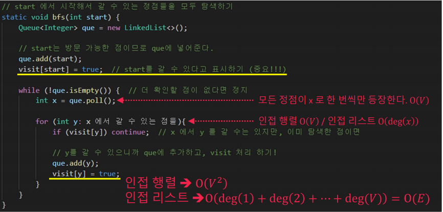

<h1> 그래프와 탐색(Graph & Search) </h1>

<h2> 그래프 </h2>

   - 자료 구조로써 정점(Vertex)와 간선(Edge) 로 구성   
     간선은 무방향/방향 + 가중치(weight)

<h3> 점점의 차수(Degree)와 성질 </h3>

   - deg(x) := 정점 x의 차수(degree), 정점 x에 연결된 간선의 수
   - ∑deg(x) = 모든 정점의 차수의 합 = 간선의 개수의 2배!   
   위 식을 알아야 그래프와 관련된 알고리즘의 시간복잡도 계산시 유용

<h3> 그래프를 저장하는 방법 </h3>

1. 인접 행렬(Adjacency Matrix)
   - int[][] adj = int new[v][v];
   - O(V^2) 만큼의 공간 필요
   - A 에서 B로 이동 가능? 가중치 얼마?   
     => O(1)   
   - 정점 A에서 갈 수 있는 정점들은?   
     => O(V)   
   만약, V = 10만, E = 50만 이라면   
   V^2 = 100억 = 10G!!!!!!!!!!   
※ 구현하기는 쉽지만 메모리 이슈가 있음!!   

2. 인접 리스트(Adjacency List)
   - ArrayList<ArrayList<Integer>> adj;   
   - O(E) 만큼의 공간 필요   
   - A 에서 B로 이동 가능? 가중치 얼마?   
     => O(min(deg(A),deg(B)))   
   - 정점 A에서 갈 수 있는 정점들은?   
     => O(deg(A))   
     
   만약, V = 10만, E = 50만 이라면   
   5 * 10^5 = 500K   

<h3> 그래프 문제의 핵심!</h3>

   - 정점(Vertex) & 간선(Edge)에 대한 정확한 정의
   - 간선 저장 방식을 확인하기

<h2> 탐색 </h2>

<h3> 그래프에서의 탐색이란? </h3>

   - 탐색 : 시작점에서 간선을 0개 이상 사용해서 갈 수 있는 정점들은 무엇인가?

1. 깊이 우선 탐색(Depth First Search, DFS)

2. 너비 우선 탐색(Breadth First Search, BFS)
   < Queue가 들고 있는 자료의 의미 >   
   방문이 가능한 정점들을 찾을 떄, Queue에 해당 정점을 넣는다   
   - Queue에 정점이 남았다 -> 아직 방문 가능한 정이 남아있다. or 탐색 중이다.
   - Queue가 비어있다. -> 시작점에서 갈 수 있는 모든 점을 찾아냈다! or 탐색이 끝났다!

<h1> 그래프와 탐색(Graph & Search) - 응용 </h1>
<h2> BFS의 부가 효과 </h2>

탐색(Search) = 시작점에서 갈 수 있는 정점들은 ?   
               몇번의 이동이 필요한가?   

BFS => 다른 정점까지 최소 이동 횟수도 계산 가능!!      
dist[i] : S에서 i까지 갈 때 필요한 최소 간선 개수, 불가하면 -1   
dist[Y] = dist[X] + 1

<h4> "최소 이동 횟수 " , "최단 시간" 키워드</h4>

최소 "이동" 횟수와 관련된 것이기 때문에,   
가중치에 대한 개념이 없는 문제에서만 생기는 부가 효과!   
      
   - 동생을 찾을 수 있는 가장 빠른 시간이 몇 초 후
   - 이동할 때 지나야하는 최소의 칸 수
   - 고슴도치가 안전하게 비버의 굴로 이동하기 위해 필요한 최소 시간
          
=> 때로는 그래프가 없는 문제에서 "정점"과 "간선"의 정의를 만들어서   
   그래프 문제로 접근해야 한다.            
    